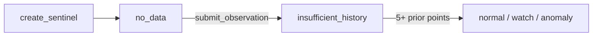

<div align="center">

# Anomaly Sentinel

### Statistical Anomaly Detection on GenLayer

[](https://docs.genlayer.com)
[](https://www.python.org)
[](https://docs.genlayer.com/developers/intelligent-contracts/tooling-setup)

A reusable primitive that tracks a numeric metric over time and classifies each
new observation as **normal**, **watch**, or **anomaly** — not against a fixed
threshold set in advance, but against a statistical baseline (mean/standard
deviation) the contract builds up on-chain as data arrives.

</div>

---

## Why this is a genuine primitive

Every "is this number unusual?" problem — gas prices, service latency, treasury
or market metrics — needs a baseline that reflects *current* conditions, not a
stale hardcoded cutoff. This contract provides it as a composable on-chain
building block:

1. **Consensus only on the raw number.** Validators reach consensus on the one
   genuinely non-deterministic step: reading a real-world numeric value off an
   external source. The anomaly classification itself is never asked of an LLM —
   it is pure arithmetic (a z-score against the recorded history), exactly
   reproducible by anyone reading the contract's history.
2. **Exact-bound observations.** The accepted value is bound to the **exact
   normalized observation** every agreeing validator independently reproduces —
   no tolerance is applied at consensus time. A looser "validators must agree
   within 5%" approach lets agreeing nodes record *different* values that
   produce the same tier now but create different running variance baselines,
   and therefore different classifications later. Binding the exact value means
   the recorded observation — and the statistical baseline every future
   observation is judged against — is identical no matter which agreeing node
   wins.
3. **Append-only, deterministic history.** Tiers are recomputed from agreed
   values + agreed state only — no subjective severity judgement is ever encoded.

---

## How it works

### The lifecycle



### Consensus design

`submit_observation` runs a leader/validator pair (`gl.vm.run_nondet_unsafe`):

1. **Extraction** — the leader fetches `source_url`, asks the LLM
   (`gl.nondet.exec_prompt`, JSON) to extract the metric's current numeric value,
   and returns it as an integer scaled by 1,000,000 (`value_millionths`).
2. **Validation** — every validator independently re-fetches and re-extracts,
   and only accepts a reading that is **exactly equal** to the leader's reading
   after normalization (`value_millionths` = value × 1,000,000, an integer, so
   the comparison is exact arithmetic). This is the property that answers "can
   validators agree a number but record different values?" — no: any difference
   between agreeing readings would change the running `sum`/`sum_sq` variance
   baseline and therefore shift every *future* z-score tier, even when the two
   values happen to share a tier today. Binding the exact observation keeps both
   the current classification and the entire future baseline identical no matter
   which agreeing node wins.
3. **Classification** — once the value is agreed, the contract deterministically
   computes the mean and standard deviation of all **prior** recorded values,
   derives a z-score, and assigns a tier from fixed bands. No further consensus
   round is needed because this is pure arithmetic over already-agreed state.

| Tier | Condition |
|---|---|
| `insufficient_history` | Fewer than 5 prior observations recorded |
| `normal` | `\|z-score\| < 1.5` |
| `watch` | `1.5 <= \|z-score\| < 3.0` |
| `anomaly` | `\|z-score\| >= 3.0` |

The `stddev == 0` edge case (all prior values identical) is handled explicitly:
an equal new value gets `z_score = 0` (`normal`); any different value is treated
as maximally anomalous instead of dividing by zero.

### Security & threat model

- **No hallucinated classification** — the LLM only extracts a number; the tier is
  deterministic arithmetic anyone can re-derive by hand from `get_history`.
- **No boundary-flip smuggling** — the validator requires the exact normalized
  observation, so every agreeing node records the same value: the same tier now
  and the identical statistical baseline for all future observations.
- **Bounded inputs** — URL/id/instruction length caps, page fetch cap (4,000
  chars), `MAX_VALUE` sanity cap on extracted magnitudes, and explicit rejection
  of negative values (metrics are assumed non-negative: prices, fees, latency).
- **No synthetic zeros** — an LLM response missing the `value` key, or yielding
  a non-finite value (`NaN`/`Inf`), is treated as an extraction failure before
  scaling. It is never stored as a `0` that would contaminate the statistical
  baseline.

---

## Public API

| Kind | Methods |
|---|---|
| Write (2) | `create_sentinel` · `submit_observation` |
| View (4) | `get_current_status` · `get_history` · `get_anomaly_count` · `list_sentinel_ids` |

## Quick start

```python
contract.create_sentinel(
    "btc_price1",
    "Bitcoin price in USD",
    "https://api.github.com/users/genlayerlabs",   # any stable numeric source
    "Extract the value of the 'followers' field from the JSON",
)

contract.submit_observation("btc_price1")   # fetch → validator consensus → classify
contract.get_current_status("btc_price1")   # {"tier": ..., "observation_count": n}
contract.get_history("btc_price1")          # append-only history
contract.get_anomaly_count("btc_price1")    # number of anomaly-tagged entries
```

---

## Verification

**15 deterministic unit tests** cover: sentinel registration and validation,
the `insufficient_history` → `normal`/`watch`/`anomaly` lifecycle, the `stddev ==
0` constant-series edge case, unknown-sentinel errors, the validator logic
(exact match accepted / any differing reading rejected — including a different
reading that would share the same tier today — and non-numeric, missing-key,
`NaN`/`Inf` rejections), and all view methods.

**Deployed & tested on GenLayer Studio** (real consensus, web and LLM) via
`scripts/onchain_test.py`:

- **Reference deployment:**
  [`0x6bfDb1c3403f92eF0AC414c0c8eA486A2bdEfbB1`](https://explorer-studio.genlayer.com/address/0x6bfDb1c3403f92eF0AC414c0c8eA486A2bdEfbB1)
- `create_sentinel` then **6 consecutive `submit_observation` rounds all reached
  consensus under the exact-binding rule** on the real GitHub follower count
  (`355.0`, every agreeing node reproduced the identical normalized reading),
  proving the leader/validator pair works on-chain with live web fetches and LLM
  extraction.
- `get_history` shows exactly the expected lifecycle: five
  `insufficient_history` entries, then the 6th classified `normal` once 5 prior
  points activate the z-score bands. `get_anomaly_count` correctly returns 0.
- The test source was chosen to stay inside the contract's 4,000-char page
  truncation: a fuller GitHub response puts `stargazers_count` past the cutoff
  and the LLM then extracts a default `0` — a data-source concern, not a
  contract bug, and it is why the script uses the compact `users` endpoint.

```bash
genvm-lint check contracts/anomaly_sentinel.py
pytest tests/test_anomaly_sentinel.py
```

---

## Demo (live on studionet)

The deployed contract is a working demo you can inspect and replay:

- **Contract:** [`0x6bfDb1c3403f92eF0AC414c0c8eA486A2bdEfbB1`](https://explorer-studio.genlayer.com/address/0x6bfDb1c3403f92eF0AC414c0c8eA486A2bdEfbB1)

The reference run — sentinel tracking the genlayerlabs GitHub follower count:

| Step | Transaction | Value recorded | Tier |
|---|---|---|---|
| Create sentinel | [`0xa4e4bcc6…8fc3bf`](https://explorer-studio.genlayer.com/tx/0xa4e4bcc6c2f3a24ca7db1b0caee6b6cc281e7aabbe6def8b22e6f066808fc3bf) | — | `no_data` |
| Submit 1 | [`0xa5c6d109…4391f3`](https://explorer-studio.genlayer.com/tx/0xa5c6d109ff67e1d2aff2a900f58a8b1f74c35a29fb1453e9f63121263b4391f3) | 355.0 | `insufficient_history` |
| Submit 2 | [`0xb0ca7c4b…91eb72d`](https://explorer-studio.genlayer.com/tx/0xb0ca7c4b5dc30b24b267e08ef4875c682168a0e77037eb4eb058ee69491eb72d) | 355.0 | `insufficient_history` |
| Submit 3 | [`0xadaafb4c…47d460`](https://explorer-studio.genlayer.com/tx/0xadaafb4cd257bfc242b45f2779b3c7eaaab81e4dc68ed93cd479b8e6ce47d460) | 355.0 | `insufficient_history` |
| Submit 4 | [`0x0608aec4…6ac4a8`](https://explorer-studio.genlayer.com/tx/0x0608aec40475500b2575c9a46468f27ca147a220007fd85ebafc0bfb066ac4a8) | 355.0 | `insufficient_history` |
| Submit 5 | [`0x92bf95a1…84c0c6fd`](https://explorer-studio.genlayer.com/tx/0x92bf95a1b99fd218ad435bf0d8e715fe4d2dc71d0bcff89abaa769cf8840c6fd) | 355.0 | `insufficient_history` |
| Submit 6 | [`0x35d2364e…bdabb40`](https://explorer-studio.genlayer.com/tx/0x35d2364e139415a7e9ef083a835689c1d95813f25f3454dacd7877046bdabb40) | 355.0 | `normal` |

Every hash above is a real, finalized transaction you can open in the explorer.
The identical `355.0` recorded in every round is the exact-binding guarantee in
action: each validator independently reproduced the same normalized reading, so
the recorded value and the running mean/variance baseline are the same no matter
which agreeing node's result won.

Replay the demo yourself against the live contract:

```bash
python scripts/onchain_test.py --address 0x6bfDb1c3403f92eF0AC414c0c8eA486A2bdEfbB1
```

---

## Implementation notes

- **Floats are not calldata-encodable** in this SDK, so no `float` ever crosses a
  consensus or view boundary. `extract_value` returns the reading as an integer
  scaled by 1,000,000 (`value_millionths`), and storage uses `u256` scaled
  integers throughout (`Observation` carries `value_millionths`,
  `z_score_abs_millionths`, and a separate `z_score_negative` bool).
- A live-testing bug found and fixed: the original leader result returned a
  plain `float` (`{"value": 63653.0}`), which crashed with `TypeError: not
  calldata encodable ... float`. Scaling to an integer in the leader/validator
  return fixed it. The same constraint applies to view returns — `get_history`
  therefore exposes the scaled integers plus the z-score sign, so clients
  unscale (divide by 1,000,000) rather than the contract returning floats.
- Running totals (`sum_millionths`, `sum_sq_scaled`) are maintained
  incrementally on each submit, so `submit_observation` never reads back the
  history array (O(1) per call).
- The square root uses a small Newton's-method helper (`_sqrt`) rather than the
  `math` module, avoiding an unverified standard-library dependency inside the
  sandbox.
- Consensus requires the **exact normalized observation**: validators reject any
  reading that differs from the leader's, however slightly. This is what makes
  the accepted value preserve both the current and every future classification.
  The trade-off is that a source which drifts between leader and validator
  execution (e.g. a fast-moving price) will be rejected and retried until a
  leader reading is reproduced exactly; the contract is best suited to metrics
  that read the same on every node's fetch (gauge-style counters, follower
  counts, fixed JSON fields).
- Known limitation: monitored values are assumed non-negative (prices, gas fees,
  latency); `submit_observation` rejects a negative extracted value explicitly.

---

## Development

Run from the repo root:

```bash
pip install -r requirements.txt
genvm-lint check contracts/anomaly_sentinel.py   # lint + SDK validation (6 methods)
pytest tests/test_anomaly_sentinel.py  # 15 tests
```

To deploy and exercise it on GenLayer Studio (free fees), use
`scripts/onchain_test.py`. The contract constructor takes no arguments; there is
no privileged owner role.

---

## References

- [GenLayer docs — Equivalence Principle](https://docs.genlayer.com/developers/intelligent-contracts/equivalence-principle)
- [GenLayer docs — Crafting Prompts](https://docs.genlayer.com/developers/intelligent-contracts/crafting-prompts)
- [GenLayer docs — Non-deterministic features](https://docs.genlayer.com/developers/intelligent-contracts/features/nondeterministic-functions)
