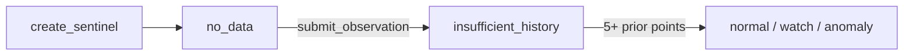

<div align="center">

# Anomaly Sentinel

### Statistical Anomaly Detection on GenLayer

[](https://docs.genlayer.com)
[](https://www.python.org)
[](https://docs.genlayer.com/developers/intelligent-contracts/tooling-setup)

A reusable primitive that tracks a numeric metric over time and classifies each
new observation as **normal**, **watch**, or **anomaly** — not against a fixed
threshold set in advance, but against a statistical baseline (mean/standard
deviation) the contract builds up on-chain as data arrives.

</div>

---

## Why this is a genuine primitive

Every "is this number unusual?" problem — gas prices, service latency, treasury
or market metrics — needs a baseline that reflects *current* conditions, not a
stale hardcoded cutoff. This contract provides it as a composable on-chain
building block:

1. **Consensus only on the raw number.** Validators reach consensus on the one
   genuinely non-deterministic step: reading a real-world numeric value off an
   external source. The anomaly classification itself is never asked of an LLM —
   it is pure arithmetic (a z-score against the recorded history), exactly
   reproducible by anyone reading the contract's history.
2. **Consensus-stable classifications.** A naive "validators must agree within
   5%" lets a value near a tier boundary silently flip `normal`↔`watch`↔`anomaly`
   between agreeing nodes. Here the validator also requires that classifying the
   leader's reading and its own reading against the **same history** yields the
   **same tier**, and that appending either value keeps the future running
   baseline statistically equivalent. Whatever value is accepted, the recorded
   classification is the one every agreeing node derived.
3. **Append-only, deterministic history.** Tiers are recomputed from agreed
   values + agreed state only — no subjective severity judgement is ever encoded.

---

## How it works

### The lifecycle



### Consensus design

`submit_observation` runs a leader/validator pair (`gl.vm.run_nondet_unsafe`):

1. **Extraction** — the leader fetches `source_url`, asks the LLM
   (`gl.nondet.exec_prompt`, JSON) to extract the metric's current numeric value,
   and returns it as an integer scaled by 1,000,000 (`value_millionths`).
2. **Validation** — every validator independently re-fetches and re-extracts, and
   only accepts a reading when all of the following hold:
   - **(a) Same value** — within the value tolerance (5%) of the leader's reading.
   - **(b) Same tier** — classifying the leader's and its own reading against the
     same recorded history yields the same `normal`/`watch`/`anomaly` tier. This
     is the property that answers "can validators agree on a number but record
     different classifications?" — no: a boundary-crossing value inside the
     tolerance is rejected outright.
   - **(c) Same future statistics** — appending either reading keeps the running
     mean statistically equivalent (within the same tolerance), so the baseline
     every future observation is judged against does not depend on which agreeing
     node's reading won.
3. **Classification** — once the value is agreed, the contract deterministically
   computes the mean and standard deviation of all **prior** recorded values,
   derives a z-score, and assigns a tier from fixed bands. No further consensus
   round is needed because this is pure arithmetic over already-agreed state.

| Tier | Condition |
|---|---|
| `insufficient_history` | Fewer than 5 prior observations recorded |
| `normal` | `\|z-score\| < 1.5` |
| `watch` | `1.5 <= \|z-score\| < 3.0` |
| `anomaly` | `\|z-score\| >= 3.0` |

The `stddev == 0` edge case (all prior values identical) is handled explicitly:
an equal new value gets `z_score = 0` (`normal`); any different value is treated
as maximally anomalous instead of dividing by zero.

### Security & threat model

- **No hallucinated classification** — the LLM only extracts a number; the tier is
  deterministic arithmetic anyone can re-derive by hand from `get_history`.
- **No boundary-flip smuggling** — the validator's tier-equivalence check (b)
  guarantees every accepted reading maps to the same recorded tier across all
  agreeing nodes.
- **Bounded inputs** — URL/id/instruction length caps, page fetch cap (4,000
  chars), `MAX_VALUE` sanity cap on extracted magnitudes, and explicit rejection
  of negative values (metrics are assumed non-negative: prices, fees, latency).

---

## Public API

| Kind | Methods |
|---|---|
| Write (2) | `create_sentinel` · `submit_observation` |
| View (4) | `get_current_status` · `get_history` · `get_anomaly_count` · `list_sentinel_ids` |

## Quick start

```python
contract.create_sentinel(
    "btc_price1",
    "Bitcoin price in USD",
    "https://api.github.com/users/genlayerlabs",   # any stable numeric source
    "Extract the value of the 'followers' field from the JSON",
)

contract.submit_observation("btc_price1")   # fetch → validator consensus → classify
contract.get_current_status("btc_price1")   # {"tier": ..., "observation_count": n}
contract.get_history("btc_price1")          # append-only history
contract.get_anomaly_count("btc_price1")    # number of anomaly-tagged entries
```

---

## Verification

**12 deterministic unit tests** cover: sentinel registration and validation,
the `insufficient_history` → `normal`/`watch`/`anomaly` lifecycle, the `stddev ==
0` constant-series edge case, unknown-sentinel errors, the validator logic
(agree / beyond tolerance / tier-flip rejected / same-tier-within-tolerance
accepted / non-numeric and out-of-range rejections), and all view methods.

**Deployed & tested on GenLayer Studio** (real consensus, web and LLM) via
`scripts/onchain_test.py`:

- **Reference deployment:**
  [`0xdB0C0f14eA2647380EF7cFB101a434719f231fD6`](https://explorer-studio.genlayer.com/address/0xdB0C0f14eA2647380EF7cFB101a434719f231fD6)
- `create_sentinel` then **6 consecutive `submit_observation` rounds all reached
  consensus** on the real GitHub follower count (`327.0`), proving the leader/
  validator pair works on-chain with live web fetches and LLM extraction.
- `get_history` shows exactly the expected lifecycle: five
  `insufficient_history` entries, then the 6th classified `normal` once 5 prior
  points activate the z-score bands. `get_anomaly_count` correctly returns 0.
- The test source was chosen to stay inside the contract's 4,000-char page
  truncation: a fuller GitHub response puts `stargazers_count` past the cutoff
  and the LLM then extracts a default `0` — a data-source concern, not a
  contract bug, and it is why the script uses the compact `users` endpoint.

```bash
genvm-lint check contracts/anomaly_sentinel.py
pytest tests/test_anomaly_sentinel.py
```

---

## Demo (live on studionet)

The deployed contract is a working demo you can inspect and replay:

- **Contract:** [`0xdB0C0f14eA2647380EF7cFB101a434719f231fD6`](https://explorer-studio.genlayer.com/address/0xdB0C0f14eA2647380EF7cFB101a434719f231fD6)

The reference run — sentinel `btc_price1` tracking the genlayerlabs GitHub
follower count:

| Step | Transaction | Value recorded | Tier |
|---|---|---|---|
| Create sentinel | [`0xda6a8ae7…03e3`](https://explorer-studio.genlayer.com/tx/0xda6a8ae75ed940f3a3717f036f8aeaa2541baa6ddf4bd4010a356975e5d703e3) | — | `no_data` |
| Submit 1 | [`0x0c304c65…89c8`](https://explorer-studio.genlayer.com/tx/0x0c304c6571206ef97d35938256c8b449f964834082211f9b70a95e04354689c8) | 327.0 | `insufficient_history` |
| Submit 2 | [`0xd112544d…a5294`](https://explorer-studio.genlayer.com/tx/0xd112544d72c783cc6a5fc5f49fd2a42b59e3ca5133346b8eff28c009befa5294) | 327.0 | `insufficient_history` |
| Submit 3 | [`0x0c17db5e…0af7`](https://explorer-studio.genlayer.com/tx/0x0c17db5ec7900e1d6c29a7662c1c946d6cd90034854c38a96b9c276805c60af7) | 327.0 | `insufficient_history` |
| Submit 4 | [`0xca63928a…6dd`](https://explorer-studio.genlayer.com/tx/0xca63928a8c1d47be49ff815a518e88ecf8c1bdbdc114393c605251fad13a36dd) | 327.0 | `insufficient_history` |
| Submit 5 | [`0xe5c691d8…855f`](https://explorer-studio.genlayer.com/tx/0xe5c691d8b4fc1b76b25940d7d894fccde3c31f207de52156a66fcdf42815855f) | 327.0 | `insufficient_history` |
| Submit 6 | [`0xc09ace64…35ad`](https://explorer-studio.genlayer.com/tx/0xc09ace6489399ee93b2854493c7c10fa284985fbcf6363cf9c0be55e20135ad3) | 327.0 | `normal` |

Every hash above is a real, finalized transaction you can open in the explorer.

Replay the demo yourself against the live contract:

```bash
python scripts/onchain_test.py --address 0xdB0C0f14eA2647380EF7cFB101a434719f231fD6
```

---

## Implementation notes

- **Floats are not calldata-encodable** in this SDK, so no `float` ever crosses a
  consensus or view boundary. `extract_value` returns the reading as an integer
  scaled by 1,000,000 (`value_millionths`), and storage uses `u256` scaled
  integers throughout (`Observation` carries `value_millionths`,
  `z_score_abs_millionths`, and a separate `z_score_negative` bool).
- A live-testing bug found and fixed: the original leader result returned a
  plain `float` (`{"value": 63653.0}`), which crashed with `TypeError: not
  calldata encodable ... float`. Scaling to an integer in the leader/validator
  return fixed it. The same constraint applies to view returns — `get_history`
  therefore exposes the scaled integers plus the z-score sign, so clients
  unscale (divide by 1,000,000) rather than the contract returning floats.
- Running totals (`sum_millionths`, `sum_sq_scaled`) are maintained
  incrementally on each submit, so `submit_observation` never reads back the
  history array (O(1) per call).
- The square root uses a small Newton's-method helper (`_sqrt`) rather than the
  `math` module, avoiding an unverified standard-library dependency inside the
  sandbox.
- Known limitation: percentage-based tolerance behaves oddly very close to zero
  (a metric legitimately near 0 makes any percentage tolerance very tight in
  absolute terms). This primitive is best suited to metrics that stay
  meaningfully away from zero.
- Known limitation: monitored values are assumed non-negative (prices, gas fees,
  latency); `submit_observation` rejects a negative extracted value explicitly.

---

## Development

Run from the repo root:

```bash
pip install -r requirements.txt
genvm-lint check contracts/anomaly_sentinel.py   # lint + SDK validation (6 methods)
pytest tests/test_anomaly_sentinel.py  # 12 tests
```

To deploy and exercise it on GenLayer Studio (free fees), use
`scripts/onchain_test.py`. The contract constructor takes no arguments; there is
no privileged owner role.

---

## References

- [GenLayer docs — Equivalence Principle](https://docs.genlayer.com/developers/intelligent-contracts/equivalence-principle)
- [GenLayer docs — Crafting Prompts](https://docs.genlayer.com/developers/intelligent-contracts/crafting-prompts)
- [GenLayer docs — Non-deterministic features](https://docs.genlayer.com/developers/intelligent-contracts/features/nondeterministic-functions)
